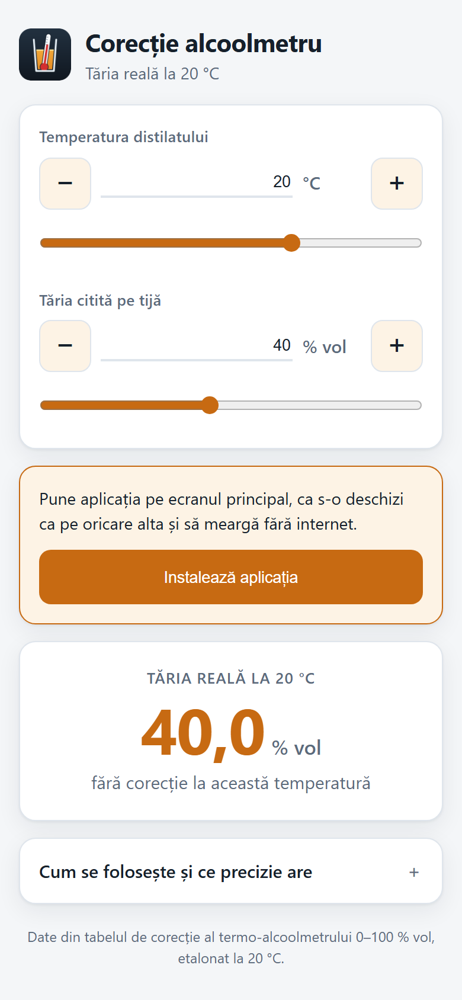

# Corecție alcoolmetru

Aplicație web care corectează tăria alcoolică citită pe alcoolmetru în funcție
de temperatura distilatului și dă **tăria reală la 20 °C**, temperatura la care
sunt etalonate instrumentele.

Două intrări — temperatura și valoarea citită pe tijă — și un rezultat. Merge
offline și se instalează pe telefon ca aplicație obișnuită.



## Deschide-o

**https://dantraistaru-maker.github.io/Alcoolmetru/**

Pe telefon o poți pune pe ecranul principal, ca să o deschizi ca pe orice altă
aplicație și să meargă fără internet:

- **Android (Chrome):** meniul ⋮ → *Adaugă la ecranul principal*
- **iPhone (Safari):** butonul de partajare → *Adaugă la ecranul principal*

## Cum se măsoară

Distilatul se pune într-un vas transparent, destul de înalt cât alcoolmetrul să
plutească liber, fără să atingă pereții sau fundul. Se citește gradația **la
baza meniscului** și se notează temperatura arătată de termometrul încorporat.
Cele două valori se introduc în aplicație.

## Datele

Tabelul de corecție al termo-alcoolmetrului 0–100 % vol etalonat la 20 °C,
extras din documentația tipărită a instrumentului. Acoperă **5–84 % vol** și
**10–30 °C**; între punctele tabelului valoarea se interpolează liniar.

Rândurile de la **0 la 9 °C** nu vin din tabelul tipărit — sunt prelungirea
calculată a tendinței lui, verificată prin reconstituirea unor rânduri
cunoscute. Abaterea estimată e sub 0,1 % vol până pe la 5 °C și ajunge la circa
0,2 % vol la 0 °C, mai mare la capetele de concentrație. Aplicația te
avertizează când intri în zona aceea.

Rezultatul are valoare orientativă. Pentru declarații fiscale sau verificări
metrologice folosește tabelul oficial și un instrument verificat metrologic.

## Structura

| Fișier | Ce face |
|---|---|
| `index.html`, `styles.css`, `app.js` | aplicația; fără build, fără dependențe |
| `date.js` | tabelul (31 temperaturi × 80 concentrații), generat |
| `sw.js`, `manifest.webmanifest` | instalare pe telefon și funcționare offline |
| `genereaza_date.py` | rescrie `date.js` din fișierul Excel sursă |
| `genereaza_icon.py` | desenează iconurile din `icons/` |

Aplicația e statică: o pui pe GitHub Pages și funcționează. Local:

```
python -m http.server 8000
```

apoi deschide `http://localhost:8000` (un server e necesar — modulele JS și
service worker-ul nu merg deschizând direct fișierul).

Dacă schimbi datele sau codul, urcă `VERSIUNE` din `sw.js`, altfel telefoanele
rămân cu versiunea din cache.

## Publicare pe GitHub Pages

1. Creezi un repo nou și urci conținutul acestui director.
2. *Settings* → *Pages* → *Source*: `Deploy from a branch`, ramura `main`,
   directorul `/ (root)`.
3. După un minut aplicația e la adresa afișată acolo.
